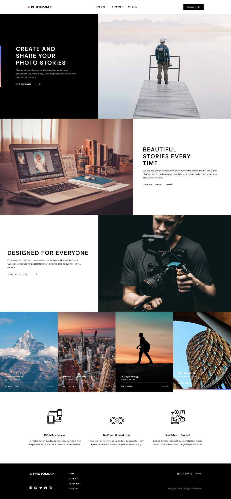

# Table of contents

- [Overview](#overview)
  - [The challenge](#the-challenge)
  - [Screenshot](#screenshot)
  - [Links](#links)
- [My process](#my-process)
  - [Built with](#built-with)
  
 
## Overview

### The challenge

Users should be able to:

- View the optimal layout for each page depending on their device's screen size
- See hover states for all interactive elements throughout the site

### Screenshot

### Links

- Live Site URL: [https://photosnap-lilac.vercel.app/](https://photosnap-lilac.vercel.app/)

## My process

### Built with

- Semantic HTML5 markup
- SCSS
- Vanilla Javascript
- Flexbox
- CSS Grid
- Mobile-first workflow

## Author

- LinkedIn - [Jasmine Collins](https://www.linkedin.com/in/jmc414/)
- Frontend Mentor - [@jmcollins414](https://www.frontendmentor.io/profile/jmcollins414)
 
